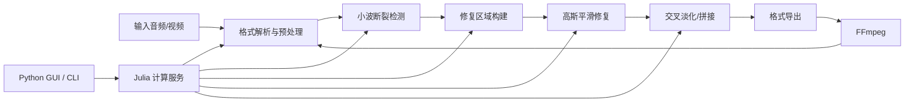

<div align="center">


# AIVoiceSeamFix

**AI 配音断裂点自动检测与平滑修复**

[](https://julialang.org/)
[](https://www.python.org/)
[](LICENSE)
[]()
[]()

</div>

<p align="center">
  <a href="README.md">中文</a> |
  <a href="README_EN.md">English</a>
</p>


---

## 📖 目录

- [概述](#概述)
- [效果演示](#效果演示)
- [系统架构](#系统架构)
- [快速开始](#快速开始)
- [API 参考](#api-参考)
- [算法参数](#算法参数)
- [项目结构](#项目结构)
- [开发指南](#开发指南)
- [测试](#测试)
- [路线图](#路线图)
- [贡献](#贡献)
- [许可证](#许可证)

---

## 概述

### 背景

AI 语音合成（TTS）引擎在生成长文本时，通常会将文本切分为多个片段，再分别合成并拼接输出。这个过程容易在波形层面产生**不连续点**，表现为时域阶跃、局部能量突变或频域宽带噪声，主观听感通常是：

- “咔哒”“爆音”“毛刺”
- 句子衔接处不自然
- 局部闷感、突兀感或音量跳变
- 多段音频拼接后接缝明显

传统修复方式通常依赖 Audition、Premiere Pro、RX 等音频编辑软件进行手动处理。对于分钟级、小时级长音频，人工定位和修复接缝效率很低，也难以稳定复现。

**AIVoiceSeamFix** 将这一流程自动化：通过**小波变换**在时频域定位断裂点，再使用**高斯卷积平滑**和**等功率交叉淡化**对局部接缝进行自然过渡，尽可能保留原音色、原节奏和非破损区域。

---

### 技术路线

| 阶段 | 方法 | 作用 |
|------|------|------|
| 检测 | 离散小波变换 DWT，默认 `db4` | 提取高频细节分量，定位局部突变 |
| 区域构建 | 自适应扩展 + 邻近区域合并 | 将孤立断裂点扩展为连续可修复区域 |
| 修复 | 高斯卷积 + 加权混合 | 平滑断裂区域，保留区域边缘原始信号 |
| 拼接 | 等功率交叉淡化 | 多段音频无缝衔接，避免音量塌陷 |
| 输出 | 格式转换 + 元数据回写 | 支持音频输出与视频音轨回灌 |

---

### 特性

- ✅ **全自动检测**：无需手动标记断裂位置
- ✅ **局部修复**：只处理断裂邻域，非破损区域保持原样
- ✅ **多格式支持**：输入 WAV / MP3 / M4A / MP4，输出 WAV / MP3 / M4A
- ✅ **视频处理**：自动提取视频音轨，修复后回灌
- ✅ **批量拼接**：支持多段音频等功率交叉淡化
- ✅ **可扩展架构**：算法插件化，新增算法只需实现标准接口
- ✅ **前后端分离**：Julia 计算服务 + Python GUI，解耦部署
- ✅ **完整测试**：270+ 单元测试，覆盖核心检测、修复与拼接路径

---

## 效果演示

> 建议在 `docs/demo/` 中放入修复前后音频、波形图或短视频，用于直观展示效果。

| 修复前 | 修复后 |
|--------|--------|
| 接缝处有可闻“咔嚓”声，波形可见明显阶跃 | 过渡平滑自然，波形连续 |
| `docs/demo/before.wav` | `docs/demo/after.wav` |
| `docs/demo/before_waveform.png` | `docs/demo/after_waveform.png` |

示例对比：

```text
原始音频  ────▁▁▁▁▁▁▁▁▁▁▁▁▁▁▁▁────
断裂接缝  ────▁▁▁▁▁▁▁▁████▁▁▁▁────
修复结果  ────▁▁▁▁▁▁▁▂▃▄▃▂▁▁────
```

---

## 系统架构

AIVoiceSeamFix 采用前后端分离设计：

- **Julia 后端**：负责音频读取、断裂检测、局部修复、拼接与导出
- **Python GUI / CLI**：负责用户交互、任务管理、文件选择、参数配置和结果展示
- **FFmpeg**：负责音视频格式转换、视频音轨提取和回灌



---

## 快速开始

### 环境要求

| 依赖 | 版本 | 用途 |
|------|------|------|
| Julia | 1.10+ | 核心算法与计算服务 |
| Python | 3.10+ | GUI、CLI 与任务编排 |
| FFmpeg | 建议 6.0+ | 音视频编解码与格式转换 |
| Git | 任意较新版本 | 拉取项目代码 |

检查环境：

```bash
julia --version
python --version
ffmpeg -version
git --version
```

---

### 1. 克隆项目

```bash
git clone https://github.com/<your-name>/AIVoiceSeamFix.git
cd AIVoiceSeamFix
```

---

### 2. 安装 Julia 依赖

```bash
cd julia_backend
julia --project=. -e 'using Pkg; Pkg.instantiate()'
```

运行 Julia 后端服务：

```bash
julia --project=. src/server.jl
```

默认服务地址：

```text
http://127.0.0.1:8080
```

> 若你的实际入口文件不是 `src/server.jl`，请替换为项目中的真实启动文件。

---

### 3. 安装 Python 依赖

```bash
cd ../python_app
python -m venv .venv
```

Windows：

```bash
.venv\Scripts\activate
```

macOS / Linux：

```bash
source .venv/bin/activate
```

安装依赖：

```bash
pip install -r requirements.txt
```

---

### 4. 启动 GUI

```bash
python app.py
```

或启动命令行模式：

```bash
python cli.py repair input.wav -o output.wav
```

---

### 5. 修复单个音频

```bash
python cli.py repair examples/input.wav \
  --output examples/output.wav \
  --threshold 0.65 \
  --window-ms 20 \
  --sigma 2.0
```

---

### 6. 批量拼接多段音频

```bash
python cli.py concat \
  part_01.wav part_02.wav part_03.wav \
  --output merged.wav \
  --crossfade-ms 50
```

---

### 7. 修复视频音轨

```bash
python cli.py repair-video input.mp4 \
  --output output.mp4 \
  --keep-video
```

---

## API 参考

> 以下接口为推荐设计，具体路径请以项目实际实现为准。

### 健康检查

```http
GET /health
```

响应示例：

```json
{
  "status": "ok",
  "service": "AIVoiceSeamFix",
  "version": "0.1.0"
}
```

---

### 检测断裂点

```http
POST /api/detect
Content-Type: multipart/form-data
```

参数：

| 字段 | 类型 | 必填 | 说明 |
|------|------|------|------|
| `file` | File | 是 | 输入音频文件 |
| `wavelet` | String | 否 | 小波基，默认 `db4` |
| `threshold` | Float | 否 | 检测阈值，默认 `0.65` |
| `min_gap_ms` | Int | 否 | 相邻断裂点最小间隔 |

响应示例：

```json
{
  "sample_rate": 44100,
  "duration": 12.34,
  "seams": [
    {
      "time": 1.245,
      "sample": 54874,
      "score": 0.91
    }
  ]
}
```

---

### 修复音频

```http
POST /api/repair
Content-Type: multipart/form-data
```

参数：

| 字段 | 类型 | 必填 | 说明 |
|------|------|------|------|
| `file` | File | 是 | 输入音频文件 |
| `threshold` | Float | 否 | 检测阈值 |
| `window_ms` | Int | 否 | 修复窗口大小 |
| `sigma` | Float | 否 | 高斯核标准差 |
| `output_format` | String | 否 | `wav`、`mp3` 或 `m4a` |

响应：

```json
{
  "status": "success",
  "seams_detected": 8,
  "regions_repaired": 6,
  "output": "output.wav"
}
```

---

### 拼接音频

```http
POST /api/concat
Content-Type: multipart/form-data
```

参数：

| 字段 | 类型 | 必填 | 说明 |
|------|------|------|------|
| `files` | File[] | 是 | 多个音频片段 |
| `crossfade_ms` | Int | 否 | 交叉淡化时长 |
| `output_format` | String | 否 | 输出格式 |

响应示例：

```json
{
  "status": "success",
  "segments": 3,
  "duration": 185.7,
  "output": "merged.wav"
}
```

---

## 算法参数

| 参数 | 默认值 | 建议范围 | 说明 |
|------|--------|----------|------|
| `wavelet` | `db4` | `db2` / `db4` / `sym4` | 小波基函数 |
| `level` | auto | 2–6 | 小波分解层数 |
| `threshold` | `0.65` | 0.3–0.9 | 断裂检测灵敏度，越低越敏感 |
| `window_ms` | `20` | 5–80 | 单个断裂点周围的修复窗口 |
| `merge_gap_ms` | `30` | 10–100 | 相邻修复区域的合并距离 |
| `sigma` | `2.0` | 0.5–5.0 | 高斯平滑强度 |
| `crossfade_ms` | `50` | 10–200 | 多段拼接时的交叉淡化时长 |
| `preserve_edges` | `true` | true / false | 是否保留修复区域边缘原始信号 |

参数调优建议：

| 场景 | 建议 |
|------|------|
| 轻微毛刺 | 提高 `threshold`，减小 `window_ms` |
| 明显爆音 | 降低 `threshold`，增大 `window_ms` |
| 拼接处音量忽大忽小 | 增大 `crossfade_ms` |
| 修复后声音发闷 | 减小 `sigma` 或缩小修复区域 |
| 漏检断裂点 | 降低 `threshold`，或提高小波分解层数 |

---

## 项目结构

```text
AIVoiceSeamFix/
├── docs/
│   ├── logo.png
│   └── demo/
│       ├── before.wav
│       ├── after.wav
│       ├── before_waveform.png
│       └── after_waveform.png
├── examples/
│   ├── input.wav
│   └── output.wav
├── julia_backend/
│   ├── Project.toml
│   ├── Manifest.toml
│   ├── src/
│   │   ├── AIVoiceSeamFix.jl
│   │   ├── server.jl
│   │   ├── detection/
│   │   ├── repair/
│   │   ├── io/
│   │   └── concat/
│   └── test/
│       ├── runtests.jl
│       ├── test_detection.jl
│       ├── test_repair.jl
│       └── test_concat.jl
├── python_app/
│   ├── app.py
│   ├── cli.py
│   ├── requirements.txt
│   ├── aivoiceseamfix/
│   │   ├── api_client.py
│   │   ├── gui/
│   │   ├── tasks/
│   │   └── utils/
│   └── tests/
├── scripts/
│   ├── build.sh
│   ├── build.ps1
│   └── package.py
├── LICENSE
└── README.md
```

---

## 开发指南

### 代码风格

- Julia 代码建议使用 `JuliaFormatter.jl`
- Python 代码建议使用 `ruff`、`black` 或项目统一格式化工具
- 核心算法模块应避免和 GUI 逻辑耦合
- 新增算法需要提供单元测试和最小示例

---

### 新增检测算法

建议实现统一接口：

```julia
abstract type AbstractSeamDetector end

struct WaveletSeamDetector <: AbstractSeamDetector
    wavelet::String
    threshold::Float64
end

function detect(detector::AbstractSeamDetector, signal, sample_rate)
    # return Vector{Seam}
end
```

---

### 新增修复算法

建议实现统一接口：

```julia
abstract type AbstractSeamRepairer end

struct GaussianRepairer <: AbstractSeamRepairer
    window_ms::Int
    sigma::Float64
end

function repair(repairer::AbstractSeamRepairer, signal, seams, sample_rate)
    # return repaired_signal
end
```

---

### Python 调用 Julia 服务

```python
from aivoiceseamfix.api_client import SeamFixClient

client = SeamFixClient(base_url="http://127.0.0.1:8080")

result = client.repair(
    input_path="input.wav",
    output_path="output.wav",
    threshold=0.65,
    window_ms=20,
    sigma=2.0,
)

print(result)
```

---

## 测试

### Julia 测试

```bash
cd julia_backend
julia --project=. -e 'using Pkg; Pkg.test()'
```

或：

```bash
julia --project=. test/runtests.jl
```

---

### Python 测试

```bash
cd python_app
pytest
```

---

### 覆盖率

```bash
pytest --cov=aivoiceseamfix
```

Julia 覆盖率可按项目实际配置运行：

```bash
julia --project=. --code-coverage=user test/runtests.jl
```

---

## 常见问题

### 1. 修复后声音变闷怎么办？

通常是修复范围过大或高斯平滑过强。可以尝试：

- 减小 `window_ms`
- 减小 `sigma`
- 提高 `threshold`，减少误检区域

---

### 2. 为什么有些断裂点没有被检测到？

可能是断裂强度较弱、背景噪声较大或阈值过高。可以尝试：

- 降低 `threshold`
- 增加小波分解层数
- 增大 `window_ms`
- 对输入音频先做响度归一化

---

### 3. 支持立体声吗？

建议内部处理时按声道独立检测或合并检测、分声道修复。实际支持情况请以当前实现为准。

---

### 4. 视频处理是否会重新编码画面？

推荐默认保留原视频流，仅替换音轨。具体是否重新编码取决于 FFmpeg 参数和输出容器格式。

---

## 路线图

- [x] 小波断裂点检测
- [x] 高斯平滑局部修复
- [x] 等功率交叉淡化拼接
- [x] Python GUI / CLI 原型
- [x] 多格式音频输入输出
- [ ] 批量任务队列
- [ ] 波形可视化与断裂点标注
- [ ] 手动微调修复区域
- [ ] GPU / 多线程加速
- [ ] VST / 插件化音频工作流集成
- [ ] Docker 一键部署
- [ ] GitHub Actions 自动测试与打包发布

---

## 贡献

欢迎提交 Issue、Pull Request 或改进建议。

建议流程：

1. Fork 本仓库
2. 创建功能分支

```bash
git checkout -b feature/your-feature
```

3. 提交修改

```bash
git commit -m "feat: add your feature"
```

4. 推送分支

```bash
git push origin feature/your-feature
```

5. 创建 Pull Request

提交 PR 前请确认：

- 已添加或更新相关测试
- 已通过 Julia 与 Python 测试
- 已更新 README 或相关文档
- 未提交大体积音视频样本文件，必要时请放入 Release 或外部存储

---

## 许可证

本项目基于 MIT License 开源，详见 [LICENSE](LICENSE)。

---

## 致谢

感谢 Julia、Python、FFmpeg 以及开源音频处理社区提供的优秀工具链。

---

<div align="center">

Made with ❤️ for cleaner AI voice production.

</div>
