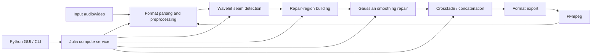

<div align="center">


# AIVoiceSeamFix

**Automatic Detection and Smooth Repair of AI Voice Seam Breaks**

[](https://julialang.org/)
[](https://www.python.org/)
[](LICENSE)
[]()
[]()

</div>

<p align="center">
  <a href="README.md">中文</a> |
  <a href="README_EN.md">English</a>
</p>

---

## Table of Contents

- [Overview](#overview)
- [Demo](#demo)
- [System Architecture](#system-architecture)
- [Quick Start](#quick-start)
- [API Reference](#api-reference)
- [Algorithm Parameters](#algorithm-parameters)
- [Project Structure](#project-structure)
- [Development Guide](#development-guide)
- [Testing](#testing)
- [Roadmap](#roadmap)
- [Contributing](#contributing)
- [License](#license)

---

## Overview

### Background

When generating long-form speech, AI text-to-speech engines often split text into multiple segments, synthesize them separately, and then concatenate the audio. This workflow can introduce **waveform discontinuities** at segment boundaries, such as time-domain steps, local energy spikes, or broadband frequency artifacts.

These discontinuities are often perceived as:

- Clicks, pops, or glitches
- Unnatural transitions between sentences
- Sudden dullness, abruptness, or volume jumps
- Noticeable seams after concatenating multiple audio clips

Traditional repair workflows usually rely on manual editing in tools such as Audition, Premiere Pro, RX, or similar audio editors. For minute-long or hour-long audio, manually locating and repairing every seam is slow, repetitive, and difficult to reproduce consistently.

**AIVoiceSeamFix** automates this process. It uses **wavelet transform** to locate seam breaks in the time-frequency domain, then applies **Gaussian convolution smoothing** and **equal-power crossfading** to create natural local transitions while preserving the original tone, rhythm, and unaffected audio regions as much as possible.

---

### Technical Approach

| Stage | Method | Purpose |
|------|--------|---------|
| Detection | Discrete Wavelet Transform, default `db4` | Extract high-frequency detail components and locate local discontinuities |
| Region Building | Adaptive expansion + nearby-region merging | Expand isolated seam points into continuous repair regions |
| Repair | Gaussian convolution + weighted blending | Smooth broken regions while preserving original signal near edges |
| Concatenation | Equal-power crossfade | Join multiple clips seamlessly without perceived volume drop |
| Output | Format conversion + metadata handling | Support audio export and video audio-track replacement |

---

### Features

- ✅ **Fully automatic detection**: no manual seam annotation required
- ✅ **Local repair only**: repair seam neighborhoods while keeping clean regions untouched
- ✅ **Multiple formats**: input WAV / MP3 / M4A / MP4, output WAV / MP3 / M4A
- ✅ **Video support**: extract, repair, and replace video audio tracks automatically
- ✅ **Batch concatenation**: equal-power crossfade for multiple audio segments
- ✅ **Extensible architecture**: plugin-style algorithm modules with standard interfaces
- ✅ **Frontend/backend separation**: Julia compute service + Python GUI / CLI
- ✅ **Well tested**: 270+ unit tests covering detection, repair, and concatenation paths

---

## Demo

> Recommended: place before/after audio samples, waveform screenshots, or short videos under `docs/demo/`.

| Before Repair | After Repair |
|---------------|--------------|
| Audible click at the seam, with a visible waveform step | Smooth and natural transition with continuous waveform |
| `docs/demo/before.wav` | `docs/demo/after.wav` |
| `docs/demo/before_waveform.png` | `docs/demo/after_waveform.png` |

Example comparison:

```text
Original audio  ────▁▁▁▁▁▁▁▁▁▁▁▁▁▁▁▁────
Broken seam     ────▁▁▁▁▁▁▁▁████▁▁▁▁────
Repaired result ────▁▁▁▁▁▁▁▂▃▄▃▂▁▁────
```

---

## System Architecture

AIVoiceSeamFix uses a separated frontend/backend architecture:

- **Julia backend**: audio I/O, seam detection, local repair, concatenation, and export
- **Python GUI / CLI**: user interaction, task management, file selection, parameter configuration, and result display
- **FFmpeg**: audio/video transcoding, audio-track extraction, and audio-track replacement



---

## Quick Start

### Requirements

| Dependency | Version | Purpose |
|-----------|---------|---------|
| Julia | 1.10+ | Core algorithms and compute service |
| Python | 3.10+ | GUI, CLI, and task orchestration |
| FFmpeg | 6.0+ recommended | Audio/video encoding and format conversion |
| Git | Recent version | Clone the repository |

Check your environment:

```bash
julia --version
python --version
ffmpeg -version
git --version
```

---

### 1. Clone the Repository

```bash
git clone https://github.com/<your-name>/AIVoiceSeamFix.git
cd AIVoiceSeamFix
```

---

### 2. Install Julia Dependencies

```bash
cd julia_backend
julia --project=. -e 'using Pkg; Pkg.instantiate()'
```

Start the Julia backend service:

```bash
julia --project=. src/server.jl
```

Default service address:

```text
http://127.0.0.1:8080
```

> If your actual entry file is not `src/server.jl`, replace it with the correct startup script in your project.

---

### 3. Install Python Dependencies

```bash
cd ../python_app
python -m venv .venv
```

Windows:

```bash
.venv\Scripts\activate
```

macOS / Linux:

```bash
source .venv/bin/activate
```

Install dependencies:

```bash
pip install -r requirements.txt
```

---

### 4. Launch the GUI

```bash
python app.py
```

Or use the command-line interface:

```bash
python cli.py repair input.wav -o output.wav
```

---

### 5. Repair a Single Audio File

```bash
python cli.py repair examples/input.wav \
  --output examples/output.wav \
  --threshold 0.65 \
  --window-ms 20 \
  --sigma 2.0
```

---

### 6. Concatenate Multiple Audio Segments

```bash
python cli.py concat \
  part_01.wav part_02.wav part_03.wav \
  --output merged.wav \
  --crossfade-ms 50
```

---

### 7. Repair a Video Audio Track

```bash
python cli.py repair-video input.mp4 \
  --output output.mp4 \
  --keep-video
```

---

## API Reference

> The following API design is recommended. Please adjust paths and fields according to the actual implementation.

### Health Check

```http
GET /health
```

Example response:

```json
{
  "status": "ok",
  "service": "AIVoiceSeamFix",
  "version": "0.1.0"
}
```

---

### Detect Seam Breaks

```http
POST /api/detect
Content-Type: multipart/form-data
```

Parameters:

| Field | Type | Required | Description |
|------|------|----------|-------------|
| `file` | File | Yes | Input audio file |
| `wavelet` | String | No | Wavelet basis, default `db4` |
| `threshold` | Float | No | Detection threshold, default `0.65` |
| `min_gap_ms` | Int | No | Minimum gap between nearby seam candidates |

Example response:

```json
{
  "sample_rate": 44100,
  "duration": 12.34,
  "seams": [
    {
      "time": 1.245,
      "sample": 54874,
      "score": 0.91
    }
  ]
}
```

---

### Repair Audio

```http
POST /api/repair
Content-Type: multipart/form-data
```

Parameters:

| Field | Type | Required | Description |
|------|------|----------|-------------|
| `file` | File | Yes | Input audio file |
| `threshold` | Float | No | Seam detection threshold |
| `window_ms` | Int | No | Repair window size |
| `sigma` | Float | No | Gaussian kernel standard deviation |
| `output_format` | String | No | `wav`, `mp3`, or `m4a` |

Example response:

```json
{
  "status": "success",
  "seams_detected": 8,
  "regions_repaired": 6,
  "output": "output.wav"
}
```

---

### Concatenate Audio

```http
POST /api/concat
Content-Type: multipart/form-data
```

Parameters:

| Field | Type | Required | Description |
|------|------|----------|-------------|
| `files` | File[] | Yes | Multiple audio segments |
| `crossfade_ms` | Int | No | Crossfade duration |
| `output_format` | String | No | Output format |

Example response:

```json
{
  "status": "success",
  "segments": 3,
  "duration": 185.7,
  "output": "merged.wav"
}
```

---

## Algorithm Parameters

| Parameter | Default | Recommended Range | Description |
|----------|---------|-------------------|-------------|
| `wavelet` | `db4` | `db2` / `db4` / `sym4` | Wavelet basis |
| `level` | auto | 2–6 | Wavelet decomposition level |
| `threshold` | `0.65` | 0.3–0.9 | Detection sensitivity; lower means more sensitive |
| `window_ms` | `20` | 5–80 | Repair window around each seam |
| `merge_gap_ms` | `30` | 10–100 | Distance for merging nearby repair regions |
| `sigma` | `2.0` | 0.5–5.0 | Gaussian smoothing strength |
| `crossfade_ms` | `50` | 10–200 | Crossfade duration for multi-segment concatenation |
| `preserve_edges` | `true` | true / false | Preserve original signal near repair-region edges |

Tuning suggestions:

| Scenario | Suggestion |
|---------|------------|
| Slight clicks | Increase `threshold`, decrease `window_ms` |
| Obvious pops | Decrease `threshold`, increase `window_ms` |
| Volume jump at joins | Increase `crossfade_ms` |
| Repaired audio sounds dull | Decrease `sigma` or shrink repair regions |
| Missed seam breaks | Decrease `threshold` or increase wavelet decomposition level |

---

## Project Structure

```text
AIVoiceSeamFix/
├── docs/
│   ├── logo.png
│   └── demo/
│       ├── before.wav
│       ├── after.wav
│       ├── before_waveform.png
│       └── after_waveform.png
├── examples/
│   ├── input.wav
│   └── output.wav
├── julia_backend/
│   ├── Project.toml
│   ├── Manifest.toml
│   ├── src/
│   │   ├── AIVoiceSeamFix.jl
│   │   ├── server.jl
│   │   ├── detection/
│   │   ├── repair/
│   │   ├── io/
│   │   └── concat/
│   └── test/
│       ├── runtests.jl
│       ├── test_detection.jl
│       ├── test_repair.jl
│       └── test_concat.jl
├── python_app/
│   ├── app.py
│   ├── cli.py
│   ├── requirements.txt
│   ├── aivoiceseamfix/
│   │   ├── api_client.py
│   │   ├── gui/
│   │   ├── tasks/
│   │   └── utils/
│   └── tests/
├── scripts/
│   ├── build.sh
│   ├── build.ps1
│   └── package.py
├── LICENSE
├── README.md
└── README_EN.md
```

---

## Development Guide

### Code Style

- Use `JuliaFormatter.jl` for Julia code when possible
- Use `ruff`, `black`, or the project’s selected formatter for Python code
- Keep core algorithms decoupled from GUI logic
- Add tests and minimal examples for every new algorithm module

---

### Adding a Detection Algorithm

Recommended interface:

```julia
abstract type AbstractSeamDetector end

struct WaveletSeamDetector <: AbstractSeamDetector
    wavelet::String
    threshold::Float64
end

function detect(detector::AbstractSeamDetector, signal, sample_rate)
    # return Vector{Seam}
end
```

---

### Adding a Repair Algorithm

Recommended interface:

```julia
abstract type AbstractSeamRepairer end

struct GaussianRepairer <: AbstractSeamRepairer
    window_ms::Int
    sigma::Float64
end

function repair(repairer::AbstractSeamRepairer, signal, seams, sample_rate)
    # return repaired_signal
end
```

---

### Calling the Julia Service from Python

```python
from aivoiceseamfix.api_client import SeamFixClient

client = SeamFixClient(base_url="http://127.0.0.1:8080")

result = client.repair(
    input_path="input.wav",
    output_path="output.wav",
    threshold=0.65,
    window_ms=20,
    sigma=2.0,
)

print(result)
```

---

## Testing

### Julia Tests

```bash
cd julia_backend
julia --project=. -e 'using Pkg; Pkg.test()'
```

Or:

```bash
julia --project=. test/runtests.jl
```

---

### Python Tests

```bash
cd python_app
pytest
```

---

### Coverage

```bash
pytest --cov=aivoiceseamfix
```

Julia coverage can be run according to your actual project configuration:

```bash
julia --project=. --code-coverage=user test/runtests.jl
```

---

## FAQ

### 1. The repaired audio sounds dull. What should I do?

This usually means the repair region is too large or Gaussian smoothing is too strong. Try:

- Decreasing `window_ms`
- Decreasing `sigma`
- Increasing `threshold` to reduce false positives

---

### 2. Why are some seam breaks not detected?

Possible causes include weak discontinuities, noisy background audio, or an overly high threshold. Try:

- Decreasing `threshold`
- Increasing the wavelet decomposition level
- Increasing `window_ms`
- Normalizing loudness before processing

---

### 3. Does it support stereo audio?

A recommended approach is to detect seams using either a merged signal or per-channel analysis, then repair each channel independently. Actual support depends on the current implementation.

---

### 4. Will video processing re-encode the video stream?

The recommended default behavior is to keep the original video stream and replace only the audio track. Whether the video is re-encoded depends on FFmpeg parameters and the output container format.

---

## Roadmap

- [x] Wavelet-based seam detection
- [x] Gaussian local smoothing repair
- [x] Equal-power crossfade concatenation
- [x] Python GUI / CLI prototype
- [x] Multi-format audio input and output
- [ ] Batch task queue
- [ ] Waveform visualization and seam annotations
- [ ] Manual repair-region adjustment
- [ ] GPU / multithread acceleration
- [ ] VST / plugin-style audio workflow integration
- [ ] One-click Docker deployment
- [ ] GitHub Actions testing and release packaging

---

## Contributing

Issues, pull requests, and suggestions are welcome.

Recommended workflow:

1. Fork this repository
2. Create a feature branch

```bash
git checkout -b feature/your-feature
```

3. Commit your changes

```bash
git commit -m "feat: add your feature"
```

4. Push the branch

```bash
git push origin feature/your-feature
```

5. Open a pull request

Before submitting a PR, please make sure:

- Relevant tests are added or updated
- Julia and Python tests pass
- README or related documentation is updated
- Large audio/video sample files are not committed directly; use Releases or external storage when necessary

---

## License

This project is licensed under the MIT License. See [LICENSE](LICENSE) for details.

---

## Acknowledgements

Thanks to Julia, Python, FFmpeg, and the open-source audio processing community for providing excellent tools and foundations.

---

<div align="center">

Made with ❤️ for cleaner AI voice production.

</div>
